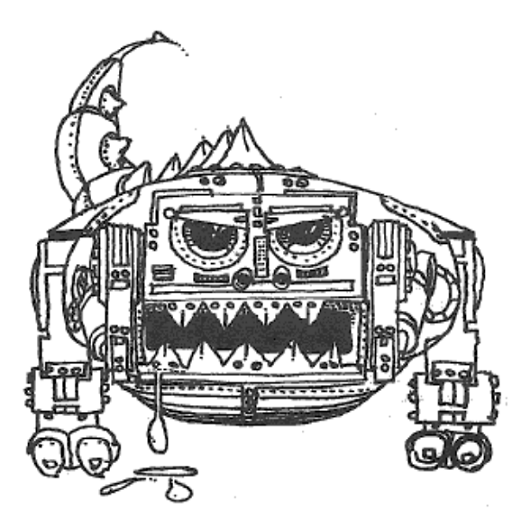

# Wumpus

Some of my first programming experience came from typing in Basic computer games from books and magazines back in the 80's.  Two classic books
that turned me into a programmer were [Basic Computer Games](https://www.atariarchives.org/basicgames/index.php) and [More Basic Computer Games](https://www.atariarchives.org/morebasicgames/) by [David H. Ahl](https://en.wikipedia.org/wiki/David_H._Ahl).

This project was created as an exercise in learning React by creating a React version of some of my first programming experience.  The 
original source code is online thanks to [AtariArchives.Org](https://www.atariarchives.org/morebasicgames/showpage.php?page=178).  I 
attempted to keep the gameplay as true to the original as possible, even if it meant that I maintained the original misspellings.  My only 
attempt to dress things up was to add a map that grows as you explore the cave.  This was made possible thanks to [React-Vis-Force](https://github.com/uber/react-vis-force).

## Demo 

The master branch is set up to automatically build and deploy to AWS Amplify.  You can play the current version [here](https://master.dbo5ovek07et.amplifyapp.com/).

## Developer Notes

This project was bootstrapped with [Create React App](https://github.com/facebook/create-react-app).  Original notes for developers are located [here](./Dev-ReadMe.md)